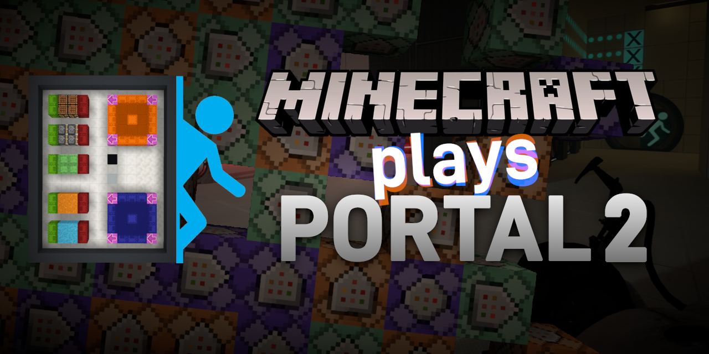

# About the project
**Minecraft Plays Portal 2** is a project that I've created to learn more about
server-based multiplayer games and how communication between clients and server
is handled. It is a primitive Minecraft server, written completely from scratch using
C++ and Winsock, that allows multiple players to control the virtual controller,
from which other softwares can fetch inputs using socket connection.

## How does it work?
This implementation of Minecraft server contains a bare minimum protocol support,
allowing the player to join the server, see and interact with other players, talk
with them in chat and move around on hard-coded controller-like structure in empty void.
Because I didn't implement anything else, this is all you can do, but that's enough
for this project. Once server is active, external software can connect using separate
handshake protocol and then receive informations about inputs generated by the controller.
In my case, I've implemented a simple client into 
[SourceAutoRecord](https://github.com/NeKzor/SourceAutoRecord/) plugin, which allowed
me a quick way of *injecting* my custom inputs into the game.

I'll link to my SAR implementation once I make one lol.
